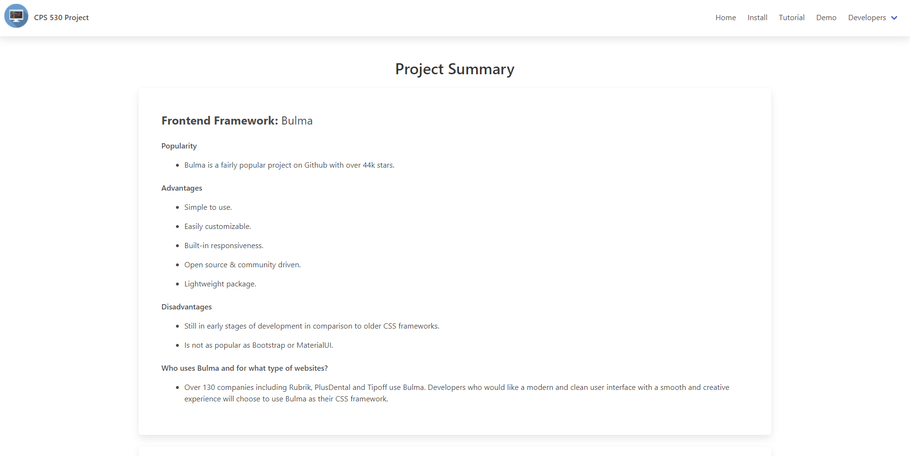
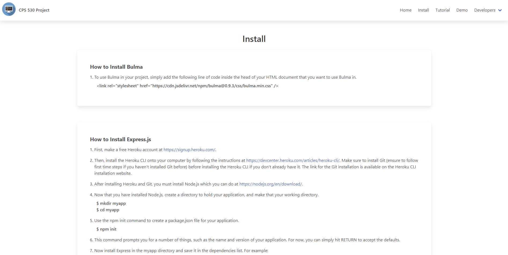
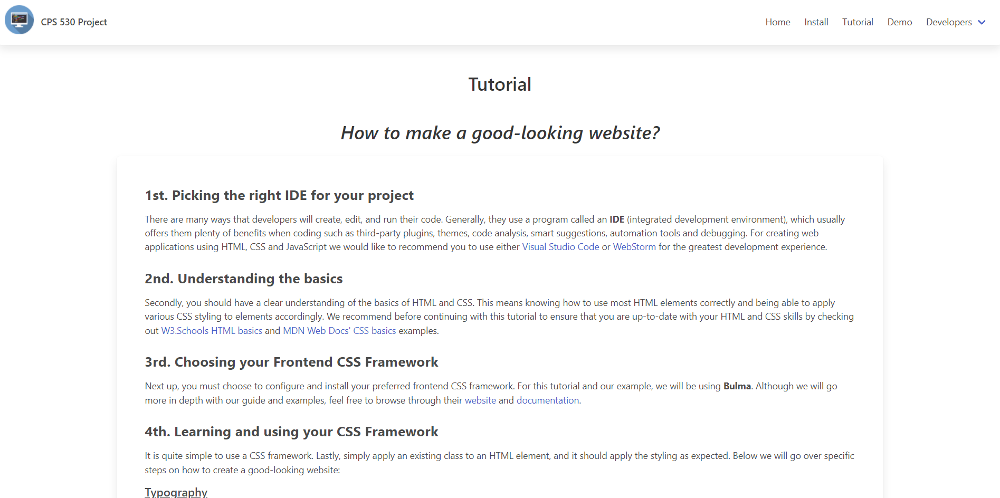
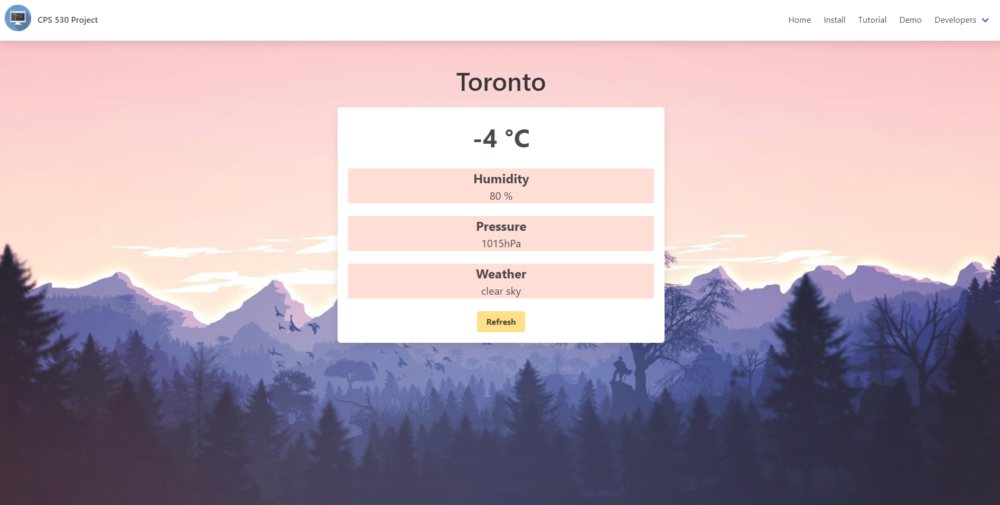
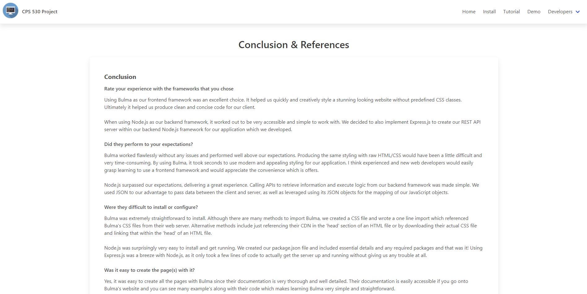
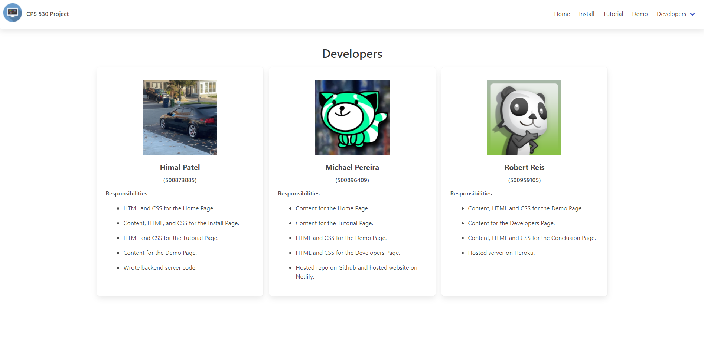

# 📃 CPS-530-Term-Project

## 🔐 Back-End

### Dependencies

- _Node_ - back-end JavaScript runtime environment
- _express_ - for running a server locally to access local files

## 🎨 Front-End

### Dependencies

-   _Bulma_ - for UI components and styling


## 📷 Gallery







View images under the ```./static/gallery/``` directory.

<a href="https://cps530-term-project.netlify.app/index.html" rel="noopener" target="_blank">Demo</a>
